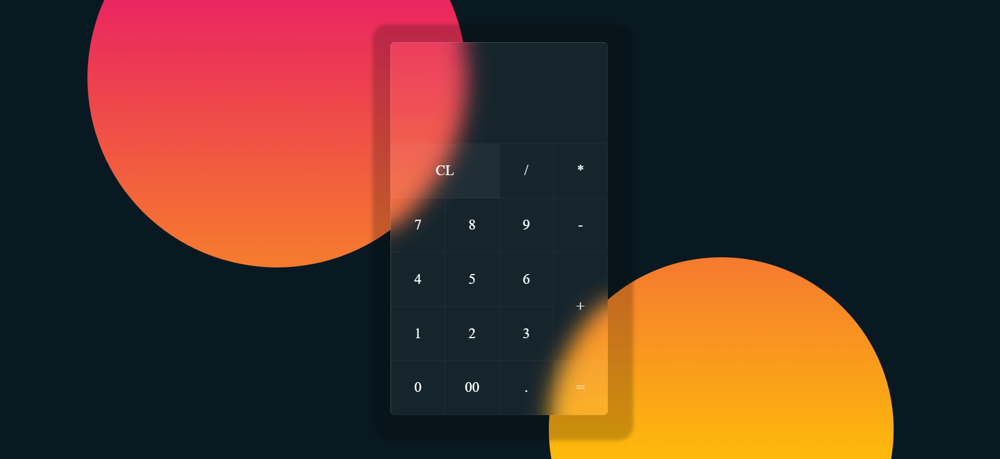

# Calculator Website

The Calculator Website is a modern and stylish web application designed to provide users with a sleek and user-friendly calculator experience. Crafted using HTML, CSS, and Vanilla-Tilt.js, this project incorporates the trendy Glassmorphism effect to create transparent and visually appealing design elements. Additionally, the interactive tilting effects provided by Vanilla-Tilt.js add a dynamic touch to the user interface, enhancing user engagement.

## Features

- **Glassmorphism Design**: The website utilizes CSS styling to create glass-like elements, contributing to a contemporary and elegant aesthetic.

- **Interactive Tilt Effects**: Vanilla-Tilt.js is integrated to apply dynamic tilting effects to elements, enhancing the overall user experience and adding an interactive dimension to the interface.

- **Responsive Layout**: The website is designed with a responsive layout, ensuring compatibility across various devices and screen sizes. Users can access the calculator website seamlessly from desktops, laptops, tablets, and smartphones.

## Technologies Used

- **HTML**: Provides the structure and semantic markup of the website's content.

- **CSS**: Implements styling and visual effects, including Glassmorphism design elements and responsive layout adjustments.

- **Vanilla-Tilt.js**: Adds interactive tilt effects to designated elements, enhancing user interactivity and engagement.

## Preview

## Contributing

Contributions are welcome! If you have any suggestions, enhancements, or bug fixes, feel free to open an issue or submit a pull request. Your contributions can help improve the Calculator Website and make it even better for users.
